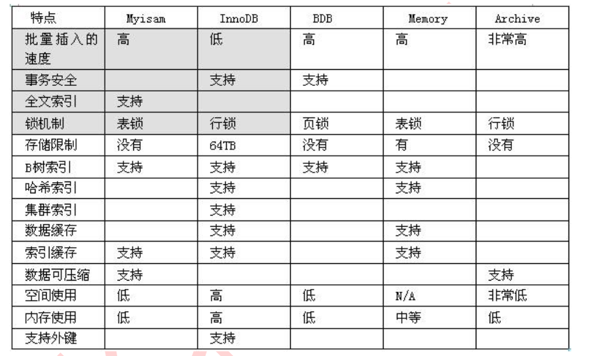

# 数据库存储引擎  
* [常见的存储引擎对比](#1)  
* [InnoDB与MyISAM](#2)

<h2 id="1">常见的存储引擎对比</h2>  

__对比表格__:
  

<h2 id="2">InnoDB与MyISAM</h2>  
虽然MySQL里的存储引擎不只是MyISAM与InnoDB这两个，但常用的就是两个。  

- 支持事务  
InnoDB:支持事务，给MySQL的表提供了事务处理、回滚、崩溃修复能力和多版本并发控制的来维护事务安全。  
MyISAM:不支持事务
- InnoDB存储引擎总支持AUTO_INCREMENT
<table style="font-size:14px">
	<tr>
    	<th>区别</th>
    	<th>MyISAM</th>
        <th>InnoDB</th>
    </tr>
	<tr>	
    	<th>存储结构</th>
        <th>每张表被存放在三个文件：  
    	frm-表格定义  
    	MYD(MYData)-数据文件  
    	MYI(MYIndex)-索引文件</th>
        <th>所有的表都保存在同一个数据文件中（也可能是多个文件，或者是独立的表空间文件），InnoDB表的大小只受限于操作系统文件的大小，一般为2GB</th>
    </tr>
    <tr>
    	<th>存储空间</th>
        <th>MyISAM数据表存储的数据可被压缩，使存储空间变小,但是压缩后的数据表不能进行写操作,只能读,并且压缩之后必须重建索引 
        MyISAM会对索引采用前缀压缩的，所以，自然会比innodb的索引要小</th>
        <th>InnoDB的表需要更多的内存和存储，它会在主内存中建立其专用的缓冲池用于高速缓冲数据和索引</th>
    </tr>
    <tr>
    	<th>可移植性、备份及恢复</th>
    	<th>由于MyISAM的数据是以文件的形式存储，所以在跨平台的数据转移中会很方便。在备份和恢复时可单独针对某个表进行操作</th>
    	<th>免费的方案可以是拷贝数据文件、备份 binlog，或者用 mysqldump，在数据量达到几十G的时候就相对痛苦了</th>
    </tr>
    <tr>
    	<th>事务安全</th>
        <th>不支持 每次查询具有原子性</th>
        <th>支持 具有事务(commit)、回滚(rollback)和崩溃修复能力(crash recovery capabilities)的事务安全(transaction-safe (ACID compliant))型表</th>
    </tr>
    <tr>
    	<th>AUTO_INCREMENT</th>
        <th>自增字段可以和其他字段一起建立联合索引</th>
        <th>1.自增字段必须有索引 2.自增字段的索引只能包含这一个字段</th>
    </tr>
    <tr>
    	<th>SELECT</th>
        <th>MyISAM更优</th>
        <th></th>
    </tr>
    <tr>
    	<th>INSERT</th>
        <th></th>
        <th>InnoDB更优</th>
    </tr>
    <tr>
    	<th>UPDATE</th>
        <th></th>
        <th>InnoDB更优</th>
    </tr>
    <tr>
    	<th>DELETE</th>
        <th></th>
        <th>InnoDB更优,它不会重新建立表，而是一行一行的删除</th>
    </tr>
    <tr>
    	<th>select count(\*) from table</th>
        <th>MyISAM更优,MyISAM只要简单的读出保存好的行数，注意的是，当count(*)语句包含 where条件时，两种表的操作是一样的</th>
        <th>InnoDB没有保存表的具体行数,也就是说，执行select count(*) from table时，InnoDB要扫描一遍整个表来计算有多少行</th>
    </tr>
    <tr>
    	<th>锁</th>
    	<th>只支持表锁</th>
        <th>支持表锁、行锁,提供行锁(locking on row level)，提供与 Oracle 类型一致的不加锁读取(non-locking read in
SELECTs)，另外，InnoDB表的行锁也不是绝对的，如果在执 行一个SQL语句时MySQL不能确定要扫描的范围，InnoDB表同样会锁全表，例如update table set num=1 where name like “%aaa%”</th>
    </tr>
    <tr>
    	<th>外键</th>
    	<th>不支持</th>
    	<th>支持</th>
    </tr>
     <tr>
    	<th>FULLTEXT全文索引</th>
    	<th>支持</th>
    	<th>不支持 可以通过使用Sphinx从InnoDB中获得全文索引，会慢一点</th>
    </tr>
</table>

#### 主要区别  
1. MyIASM不支持事务，而InnoDB支持事务
2. MyIASM锁的粒度是表级的，而InnoDB支持行级锁
3. MyIASM不支持外键约束,InnoDB支持
3. MyIASM支持全文类型索引，而InnoDB不支持全文索引
4. MyIASM表保存成文件形式，跨平台使用更加方便
5. MyIASM保存表的行数,InnoDB没有保存,当SELECT COUNT(*) FROM TABLE时InnoDB需要扫描全表,比较慢。

#### 两种引擎的选择
- __InnoDB__:  
 * 如果你的应用程序一定要使用事务，毫无疑问你要选择INNODB引擎，因为它支持事务处理和故障恢复。
 * 主键查询在InnoDB引擎下比较快(不过需要注意的是如果主键太长也会导致性能问题),由于支持行级锁，写操作不会锁定全表，所以在并发较高时，使用Innodb引擎会提升效率。但是使用行级锁也不是绝对的，如果在执行一个SQL语句时MySQL不能确定要扫描的范围(非主键的WHERE)，InnoDB表同样会锁全表。  
 * 如果在应用中执行大量insert和update操作，应该选择InnoDB 
- __MyIASM__:  
 * MyIASM管理非事务表，提供高速存储和检索以及全文搜索能力，如果读操作(执行大量select操作)远远多于写操作且不需要数据库事务的支持，应该选择MyIASM

