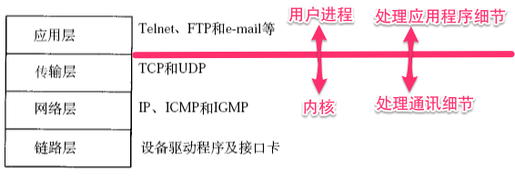

# OSI七层模型与TCP/IP四层模型  
  
  ### OSI七层模型
  ###### OSI是Open System Interconnect的缩写，意为开放式系统互联。

  OSI|功能|设备|对应协议  
  -|-|-
  应用层 | 为不同的应用场景提供不同的服务(超文本传输，电子邮件，文件传输,文件服务，虚拟终端) | 网关 | HTTP(80/TCP), HTTPS(443/UDP),FTP(TCP/21),TFTP(69/UDP),SNMP(25/TCP),SMTP(25/TCP)，DNS(53/TCP或UDP)，POP3(110/TCP),Telnet(23/TCP)  
  表示层 | 数据的表示、压缩和加密（数据格式化，代码转换，数据加密) | 网关 | 无   
  会话层 | 提供包括访问验证和会话管理(会话的建立和结束) | 网关 | 无  
  传输层 | 提供端对端的连接 | 网关 | TCP，UDP  
  网络层 | 1.对应用层数据分组传送2.选择合适的路由|路由器 | IP，ICMP,ARP,RARP  
  数据链路层 | 1.封装数据包为数据帧；2.在不可靠的物理介质上提供可靠的传输 | 交换机、网桥、网卡 | SLIP，CSLIP，PPP，ARP，RARP，MTU  
  物理层 | 传输比特流，以二进制数据形式在物理媒体上传输数据 | 集线器、中继器 | ISO2110，IEEE802，IEEE802.2  
### TCP/IP四层协议栈
__应用层__:OSI的应用层,表示层和会话层  
__传输层__:OSI的传输层  
__网络层/网际层__:OSI的网络层  
__数据链路层__:OSI的数据链路层和物理层  

> #### 应用层  
> - ___作用___:为不同种类的应用程序提供不同的服务  
> - ___常见应用层协议___:  
> 超文本传输协议:HTTP(80/TCP),HTTPS(443/UDP)  
> 文件传输协议:FTP(TCP/21),TFTP(69/UDP)  
> 简单网络管理协议:SNMP(25/TCP):SNMP接收网络节点的通知消息以及告警事件报告等来获知网络出现的问题.    
> 简单邮件传送协议:SMTP(25/TCP) 
> 邮件读取协议:POP3(110/TCP)     
> 域名解析协议:DNS(53/TCP或UDP)  
> 远程终端协议:Telnet(23/TCP) 
> - ___应用层协议应该定义什么?___  
>	1. 报文类型:如请求报文和相应报文.  
>	2. 各种类型报文的语法,如报文中的各个字段和详细描述.
>	3. 字段的语义:即每个字段中信息的含义.
>	4. 进程何时,如何发送报文以及对报文进行相应的规则. 　　

　
> #### 传输层
> ___作用___: