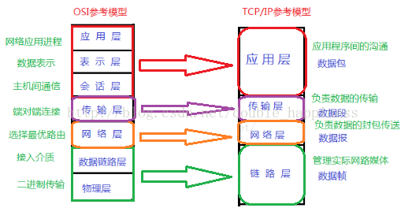

# OSI七层模型与TCP/IP四层模型  
  
  ### OSI七层模型
  ###### OSI是Open System Interconnect的缩写，意为开放式系统互联。

  OSI|功能|设备|对应协议  
  -|-|-  
  应用层 | 为不同的应用场景提供不同的服务(超文本传输，电子邮件，文件传输,文件服务，虚拟终端) | 网关 | HTTP(80/TCP), HTTPS(443/UDP),FTP(TCP/21),TFTP(69/UDP),SNMP(25/TCP),SMTP(25/TCP)，DNS(53/TCP或UDP)，POP3(110/TCP),Telnet(23/TCP)  
  表示层 | 数据的表示、压缩和加密（数据格式化，代码转换，数据加密) | 网关 | 无   
  会话层 | 提供包括访问验证和会话管理(会话的建立和结束) | 网关 | 无  
  传输层 | 提供端对端的连接 | 网关 | TCP，UDP  
  网络层 | 1.对应用层数据分组传送2.选择合适的路由|路由器 | IP，ICMP,IGMP,ARP,RARP  
  数据链路层 | 1.封装数据包为数据帧；2.在不可靠的物理介质上提供可靠的传输 |  网卡、交换机、网桥 | PPP，SLIP，CSLIP，MTU  
  物理层 | 传输比特流，以二进制数据形式在物理媒体上传输数据 | 集线器、中继器、调制解调器 | ISO2110，IEEE802，IEEE802.2  
### TCP/IP四层协议栈  
__OSI七层模型与TCP/IP四层协议栈的对应关系:__

  
__数据在传输中是怎么经过这些层的?__  

> #### 物理层(不属于TCP/IP四层协议栈)  
> - ___主要任务___:  
	1. 实现比特流的透明传输,发1收1,发0收0;  
	2. 尽可能屏蔽掉传输介质与物理设备的差异,使其上面的数据链路层不必考率网络的具体传输介质是什么.
> -  __基本传输单元__:比特流(位)  

　
> #### 数据链路层/网络接口层
> - __基本传输单元__:帧
> - ___主要任务___:  
>  1. 封装成帧:在两个相邻节点之间传输数据    
 发数据：将网络层传下来的数据封装成帧发送出去  
 收数据：将接收到的帧中的数据取出并交给上层网络层 
 
 MTU:最大传输单元,如果数据大于MTU,需要在网络层进行分片.
  2. 透明传输:封装成帧的数据不能包含帧开始和结束的界定符,如果内部有帧界定符出现,则采用字符填充法在数剧中出现'SOH'和'EOT'的前面加入转义字符ESC.如果字符本身是ESC也需要在其前面加入ESC来转义.  
_注:帧开始符:SOH,二进制:00000001;帧结束符:EOT,二进制:00000100_

  3. 差错检验:CRC校验  
 保证数据的无差错接收,但不能保证传输的可靠性.也就是说,传输过来的数据肯定是正确的,但是不能保证帧重复,帧乱序,帧丢失等情况.   
__如何进行CRC校验?__  
发送端与接收端提前约定好除数P  
_发送端_:  
实际传输的数据=真实需要传输的数据(k位)+FCS帧检验序列(n位);  
计算FCS,例子如下:  
真实需要传输的数据M = 101001 , 除数P = 1101  
在M的后面添加p的位数-1个0,在这里就是3个0;然后用这个数处以除数P,得到的余数就是FCS.(二进制除法的时候用异或运算)  

FCS=001,所以最终发出去的数据为101001001  
_接收端_:  
接受端收到发送过来的数据101001001,用它除以除数P,检查余数是否为0.   
如果为0,则接收到的这个帧的每一个比特位均无差错,就接收.  
如果不为0,则出现差错,就丢弃.

　
 > #### 网络层/网际层   [(网络层详解)](网络层.md)
> - ___主要任务___:  
>	1. 提供点到点,不可靠的传输(点指主机或路由器)
>	2. 路由:选择合适的下一跳地址  
> - __基本传输单元__:IP数据报(分组)

　
> #### 传输层
> - ___主要任务___:  
>	1. 提供端到端的传输(端指源主机和目的主机)
>	2. 由于一台主机可同时运行多个进程，因此运输层有复用和分用的功能。
> - __基本传输单元__:数据段
  
　
> #### 应用层  
> - ___主要任务___:为不同种类的应用程序提供不同的服务,直接向用户提供服务,完成用户希望在网络上完成的各种工作,负责完成网络中应用程序与网络操作系统之间的联系，建立与结束使用者之间的联系，并完成网络用户提出的各种网络服务及应用所需的监督、管理和服务等各种协议。此外，该层还负责协调各个应用程序间的工作。  
> - ___常见应用层协议___:  
> 超文本传输协议:HTTP(80/TCP),HTTPS(443/UDP)  
> 文件传输协议:FTP(TCP/21),TFTP(69/UDP)  
> 简单网络管理协议:SNMP(25/TCP):SNMP接收网络节点的通知消息以及告警事件报告等来获知网络出现的问题.    
> 简单邮件传送协议:SMTP(25/TCP) 
> 邮件读取协议:POP3(110/TCP)     
> 域名解析协议:DNS(53/TCP或UDP)  
> 远程终端协议:Telnet(23/TCP) 
> - ___应用层协议应该定义什么?___  
>	1. 报文类型:如请求报文和相应报文.  
>	2. 各种类型报文的语法,如报文中的各个字段和详细描述.
>	3. 字段的语义:即每个字段中信息的含义.
>	4. 进程何时,如何发送报文以及对报文进行相应的规则. 　
  