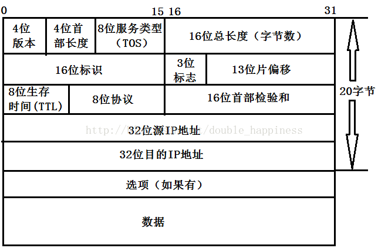

# 网络层
* [网络层简介](#1)
* [IP地址与MAC地址](#2)
* [IP协议](#3)
* [路由](#4)  

<h2 id="2">IP地址与MAC地址</h2>

* mac地址: 出厂时已经固化在网卡的ROM中. 全球唯一,是48位物理地址,数据链路层和物理层使用的地址.   	 	
* IP地址 = 网络号+主机号,是32位逻辑地址,方便寻址.网络层及以上层使用的地址.  
 * IP地址__唯一性__  
 IP地址分为了公网地址和私网地址。公网地址就是互联网（Internet）上面的地址，全球唯一。私网地址只要在私网内唯一就可以了.   
 * 为什么电脑的IP地址一直在变?因为IP地址是动态获取的,IPV4地址数量有限
* 有了IP地址,为什么还要有mac地址?  
  1. 整体与局部:  
  	mac地址相当于下一跳地址;IP地址相当于终点地址.在数据转发过程中,mac地址会一直改变,它起到记录下一跳地址的作用.如果mac地址不发生改变则找不到下一跳的地址.   
    <注：一般来说IP地址经过路由器是不变的，不过NAT（Network address translation）例外>  
  2. 分层实现:  
  	其实在IP数据报中加一个字段表示下一跳IP地址,理论上说也如果IP地址够用,交换机也支持IP地址转发,其实mac地址并不是必要的,这样设计可以让网络层和数据链路层的协议更灵活,两层互不干扰,使分层更清晰,使每层可以灵活使用协议.  
    
<h2 id="3">IP协议</h2>  
- IP协议的作用:向上提无状态,无连接,不保证可靠性的传输服务.向下提供数据报的分片.  
	* 无状态:通信双方不同步传输数据的信息,数据的发送,传输,和接收相互独立,每个数据报之间没有上下文关系.  
	优点:不用同步传输双方的数居信息,简单,高效  
    缺点:无法知道对端的数据接收情况,无法处理数据报(分片之前)丢失,乱序和重复的问题.  
    * 无连接:IP通信双方不保存对方的任何信息.
    * 不可靠:可能出现出错,丢失,乱序,重复等情况.  
- 数据报内容实现的功能：  
1）报头与有效载荷分离 －－首部长度（Internet Header Length，IHL）、总长度字段  
2）分片与组合－－标识字段、标志位字段、片偏移字段  
3）不能无限转发－－生存时间（TTL：Time to Live）字段  
4）交付上层-－协议字段  
5）对首部校验－－首部校验和字段  
6）从哪来，去哪里－－源IP地址、目标IP地址字段
- IP数据报格式:  
    

ARP协议  
ICMP协议  
IGMP协议  
