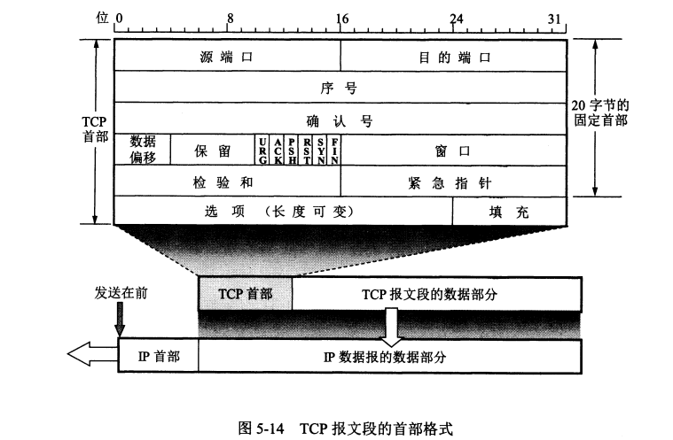
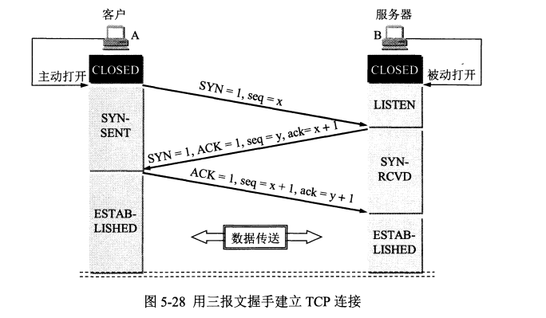
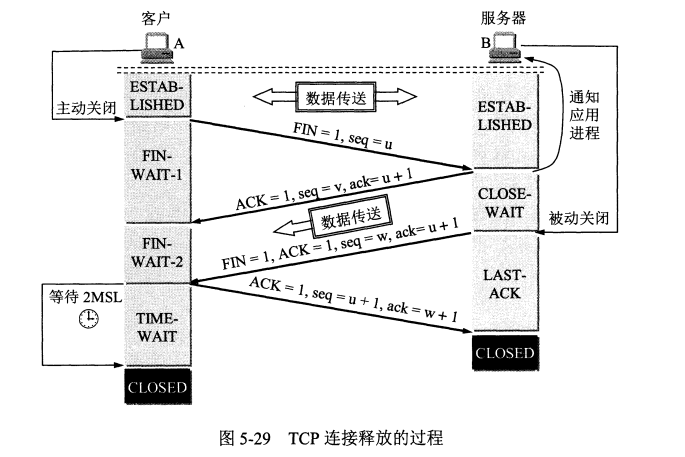

# 运输层详解  
* [传输层的作用](#1)  
* [UDP协议](#2)
* [TCP协议](#3)
	- [TCP报文段首部格式](#31)
	- [TCP如何确保可靠性](#32)
	- [TCP三次握手与四次挥手](#33)
* [TCP与UDP](#4)  
	- [TCP与UDP的区别与联系](#41) 
	- [为什么TCP比UDP更可靠](#42) 

<h2 id="1">传输层的作用</h2>

1. __为什么要有传输层?__    
网络层：点到点的通信（点：主机），通信的两端是两个主机  
运输层：端到端的通信（端：主机中的进程），通信的两端是主机中的进程  
而真正通信的是主机中的进程，所以要设置传输层。  

2. __传输层的作用:__  
运输层可以理解成一个单位的收发室，单位所有的人发送东西都交给收发室，由收发室发出（复用），所有寄来的东西也都由收发室接收，然后再传递给公司的某个人。收发室不关心中间的传输过程。

3. __全双工通信与半双工通信: __   
半双工通信：你能传给我，我能传给你。在同一时刻只能由一方传给另一方。   
全双工通信：在任意时刻都能双方互传。  

<h2 id="2">UDP协议</h2>  

<h2 id="3">TCP协议</h2>
<h5 id="31">一. TCP报文段首部格式</h5>

  
1. 源端口和目的端口:实现分用功能,将TCP报文的数据交给应用层对应端口的进程.  
2. 序号:范围[0, 2^32 - 1],到了2^32 - 1之后,下一个序号又从0开始.在一个TCP连接中传送的字节流中的每一个字节都按顺序编号.

<h5 id="32">二. TCP如何确保可靠性</h5>

1. 基于请求确认机制。只有经过确认的消息才具有可靠性。最新发出的未经过确认的数据无法保证其可靠性.  
2. 基于序号的请求确认机制，保证数据的按序到达。  
我有我的序号，你有你的序号，这两个序号毫不相干。为什么有两个序号？因为要提供全双工通信。  
32位序号：是我的序号。  我给你发报文的序号。  
32位确认序号：我确认你发送的报文的确认序号＝你的序号＋1。你发送序号之前的报文我已经收到。  
3. 重传机制  
__丢包重传__：基于序号可以确认出是否丢包，如果丢包，触发重传机制。  
__超时重传__：定时器超时，进行重传。  

4. 基于滑动窗口来进行流量控制。 告诉对方我能接收的数据大小。滑动窗口：接收缓冲区剩余的大小,滑动窗口里填自己接收缓冲区剩余的大小。  
可以不要滑动窗口吗？可以。但是如果不用的话，发送方发送很快，接收方缓冲区满了,会造成接收方出现大面积丢包问题。因为我不知道你能接受多少个，我就一直发，可以你的接受窗口已经满了，把多余的都丢掉了，造成严重丢包问题。  

5. 拥塞避免：如果出现大面积丢包，不立即重传，执行网络拥塞避免算法（当网络拥塞了怎么处理）。  
6. TCP会维护多种定时器，通过定时器来维护可靠性。

<h5 id="33">三. TCP三次握手与四次挥手</h5>  

<h2 id="4">TCP与UDP</h2>  
<h5 id="41">一. UDP与TCP的主要特点：联系与区别</h5>

UDP | TCP   
- | -   
1. UDP是无连接 | 1.TCP是面向连接的运输层协议  
2.UDP不保证可靠传输，尽最大努力交付 |2.TCP提供可靠传输（传输数据无差错、不丢失、不重复、按序到达）
3.UDP是面向报文的（一次交付一个完整的报文）| 3.TCP是面向字节流的。（一次可以发送或接收若干个字节）
4.UDP没有拥塞控制（网络拥塞不会使源主机发送速率降低）|4.TCP提供全双工通信（允许通信双方的应用进程在任何时刻都能发送数据）
5.UDP支持一对一、一对多、多对多的交互通信|5.TCP只能是一对一，每条TCP连接只能有两个端点
6.UDP的首部开销小(UDP：8字节)|6.TCP首部开销大（TCP：20字节）  

<h5 id="42">二. 为什么TCP比UDP可靠?</h5>  
1. TCP提供多种机制来维护可靠性,UDP没有提供.  
详见:[TCP确保可靠性机制](#32)  
2. socket缓冲区:  
__TCP__: 每个TCP socket在内核中都有一个发送缓冲区和一个接受缓冲区.  
1)TCP是基于请求确认机制的,只有当接收到一个TCP数据报的ACK确认号之后,才可以把这个数据报的数据内容从socket发送缓冲区中删除掉.  
2)TCP有流量控制,如果socket接收缓冲区满了,接收端会通过滑动窗口的大小告诉发送端接收缓冲区的大小,让发送端发送数据量在这个范围之内.  
__UDP__: 只有一个接收缓冲区,没有发送缓冲区,所以只要发送端有数据要发送,不管接收方是否能接受都会发送.因为UDP没有流量控制,如果接收端的缓冲区满了,新来的数据就无法进入接收缓冲区,此数据报就会被丢弃,所以不可靠.
